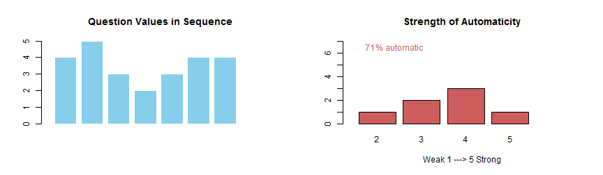

## Motivation
<blockquote>
You can't improve something unless you manage it and you can't manage it unless you measure it. ~ Tony Robbins
</blockquote>

Building healthy habits is paramount for anyone intending to grow as a person or desiring to perform at a high level.

Tracking habit formation in response to deliberate daily repetition is a key activity to help you keep on track until it becomes automatic.


---

## Description

Habit Trails does just that by letting you self-report your level of automaticity on a daily basis using a subset of the Self-Report Habit Index (SRHI), a tested psychological tool used in academic research.


---

## Sample Plots for Daily Entries


```r
## r code
x <- c(4,5,3,2,3,4,4) # sample daily entry
par(mfrow=c(1,2))
barplot(x,  col = 'skyblue', border = 'white', xlim = c(0,10), ylim = c(0,5),main = "Question Values in Sequence")
y <- table(x)      
barplot(y, xlim = c(0,6), ylim = c(0,7), col = "indianred",
main = "Strength of Automaticity", xlab = "Weak 1 ---> 5 Strong")
text(0.5,6.5,round(100*sum(x)/35,0), col = "indianred")
text(1.3,6.5,"% automatic", col = "indianred")
```



---

## Sample Cumulative Plot of Automaticity


```r
## r code
z <- c(18,19,20,22,18,25,22,23,22,26,27,24,26,28,29,24,25,26,26) # sample daily entry
zp <- round(100*z/35,0)
plot(zp,  col = 'indianred', main = "Habit Formation Pattern", ylim = c(0,100), xlab = "Days", ylab = "Automaticity")
text(1,90,round(100*(sum(z)/length(z))/35,0), col = "indianred")
text(2,90,"% automatic", col = "indianred")
```


---

## Why To Use Habit Trails

You can only improve that which you measure. Seeing your performance will:

1. Provide a source of pride because you are doing well or
2. Help you realize where you really stand and improve it or
3. Help you reassess where you need help or
4. Help you realize this isn't a real goal at this time

Whatever you see, you are better informed and can really improve yourself.

### Go for it!


